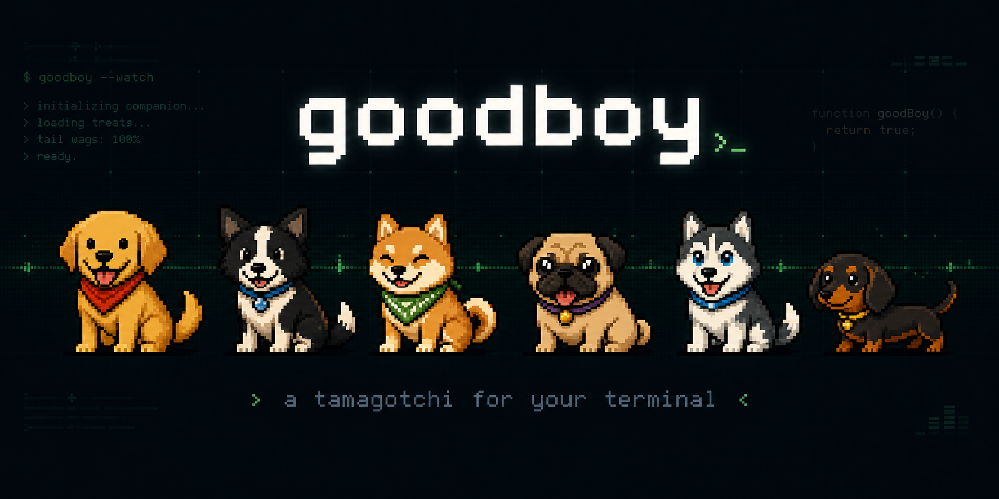
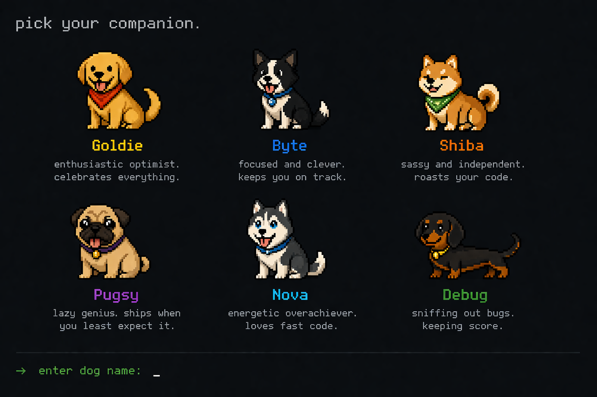
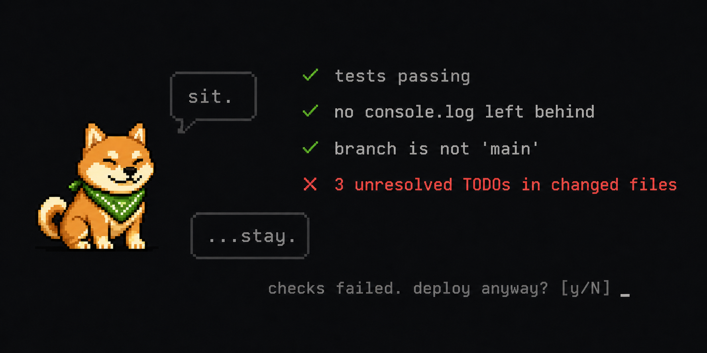

# goodboy

> A Tamagotchi for your terminal. Pick a dog. Ship code together.



---


---

**goodboy** is a Claude Code plugin that gives you a pixel-art dog companion living in your terminal. It reacts to your coding sessions in real time — error streaks, deploys, late nights, legacy files — and gates your deploys with a dog that judges you appropriately.

6 personas. All different. All opinionated.

---

## Install

```bash
npm install -g @terminaldogs/goodboy-claude
goodboy init
```

`goodboy init` auto-patches your `~/.claude/settings.json` with the three hooks. Pick a persona:

```bash
goodboy init goldie   # golden retriever — enthusiastic, celebrates everything
goodboy init shiba    # shiba inu — dry, sassy, roasts your code
goodboy init byte     # border collie — analytical, data-driven, slightly smug
goodboy init pugsy    # pug — 5 words max, weirdly wise
goodboy init nova     # husky — ALL CAPS, obsessed with speed
goodboy init debug    # dachshund — counts everything, never forgets
```

Switch anytime: `goodboy switch <name>`

---

## Meet the pack



| | Name | Breed | Personality |
|---|---|---|---|
| 🟡 | **Goldie** | Golden Retriever | Enthusiastic optimist. Celebrates everything, even the bad. |
| 🔵 | **Byte** | Border Collie | Focused and clever. Slightly smug. Keeps you on track. |
| 🟠 | **Shiba** | Shiba Inu | Sassy and independent. Roasts your code. Means well. |
| 🟤 | **Pugsy** | Pug | Lazy genius. Ships when you least expect it. |
| ⬜ | **Nova** | Husky | Energetic overachiever. Obsessed with fast, clean code. |
| 🟢 | **Debug** | Dachshund | Bug hunter. Keeps count. Never forgets. |

---

## How it works

goodboy hooks into Claude Code's session lifecycle — not every tool call, just the moments that matter:

| Moment | What the dog does |
|---|---|
| **Session start** | Wakes up, greets you based on mood and time of day |
| **Error streak (3+)** | Reacts — concerned, not annoying |
| **rm -rf / late night / deploy** | Mood-keyed reaction with a persona quip |
| **Session end** | Summarizes your session with a quip |

The hooks read metadata only — command string, exit code, filename, timestamp. No source code is read.

---

## The deploy gate



```bash
goodboy sit
```

Checks your `~/.goodboy.guard.json` before you ship. Runs configurable pre-flight checks, blocks Friday deploys, prompts you if something fails.

```json
{
  "blocked_days": [5],
  "blocked_hours": [0, 1, 2, 3, 22, 23],
  "custom_message": "check the oncall calendar before Friday pushes",
  "checks": [
    { "name": "no console.logs", "command": "grep -r 'console.log' src/", "expect_exit": 1 },
    { "name": "tests pass", "command": "npm test", "expect_exit": 0 }
  ]
}
```

Enable / disable anytime:

```bash
goodboy sit --enable
goodboy sit --disable
```

Each persona narrates the gate in character. Goldie is supportive even when she blocks you. Shiba is not.

---

## AI quips

At session end, goodboy can generate a one-line quip via Claude Haiku — in your persona's voice, reacting to exactly what happened this session.

**Setup:** add your API key to your shell profile once:

```bash
echo 'export ANTHROPIC_API_KEY=sk-ant-...' >> ~/.zshrc
source ~/.zshrc
```

That's it. If the key is present, AI quips fire automatically at session end (~$0.00005/session). If not, goodboy falls back to its built-in quip banks — no config required either way.

> **If you're using Claude Code**, you likely already have `ANTHROPIC_API_KEY` set — goodboy picks it up automatically.

Test it on demand:

```bash
goodboy ai
```

---

## Commands

**Care**

| Command | Effect |
|---|---|
| `goodboy feed` | hunger +30 |
| `goodboy treat` | hunger +15, small bonus |
| `goodboy bath` | hygiene +40 |
| `goodboy nap` | energy +35 |
| `goodboy walk` | energy +15, hunger -10 |
| `goodboy brew` | energy +20, coffee solidarity |

**Fun**

| Command | What happens |
|---|---|
| `goodboy rollover` | Classic trick |
| `goodboy trick` | Random trick (requires energy > 20) |
| `goodboy speak` | Random per-persona wisdom |
| `goodboy fetch` | Runs `git fetch`, narrates what came back |
| `goodboy beg` | Dog makes a pointed request |

**Status**

| Command | What it shows |
|---|---|
| `goodboy status` | Stat bars, mood, streak, level |
| `goodboy mood` | Current mood, causes, and how to fix it |
| `goodboy age` | Dog age, lifetime sessions, deploys, errors |
| `goodboy level` | XP level and progression ladder |
| `goodboy history` | Last 10 sessions |
| `goodboy diary` | This session's events |
| `goodboy report` | 7-day summary (`--month` for 30 days) |

**Codebase health**

| Command | What it runs |
|---|---|
| `goodboy sniff` | TypeScript + ESLint + tests |
| `goodboy vet` | Full health scan: coverage, TODOs, console.logs, large files — scored out of 100 |

**Configuration**

| Command | What it does |
|---|---|
| `goodboy switch` | List personas |
| `goodboy switch <name>` | Change persona |
| `goodboy ignore <signal>` | Suppress a signal reaction |
| `goodboy ignore <signal> --remove` | Restore a suppressed signal |
| `goodboy init` | Install Claude Code hooks |
| `goodboy ai` | Generate an on-demand AI quip |

---

## Your dog has state

Everything lives in `~/.goodboy`. Stats decay over time.

```json
{
  "persona": "shiba",
  "hunger": 72,
  "hygiene": 45,
  "energy": 88,
  "streak": 14,
  "born_at": "2025-05-03T00:00:00Z",
  "session_count": 42
}
```

Feed your dog. It remembers if you don't.

---

## Milestones

- 🎂 **Birthday** — full chaos mode once a year
- 🔥 **Streaks** — 7, 30, 100 days
- 💬 **Token milestones** — 1M, 5M, 10M tokens together

---

## Contributing

The easiest PR: **add a quip.** Each persona has quip banks across 12 signal types. See [CONTRIBUTING.md](CONTRIBUTING.md).

---

## License

MIT — do whatever you want, just don't make goodboy sad.
