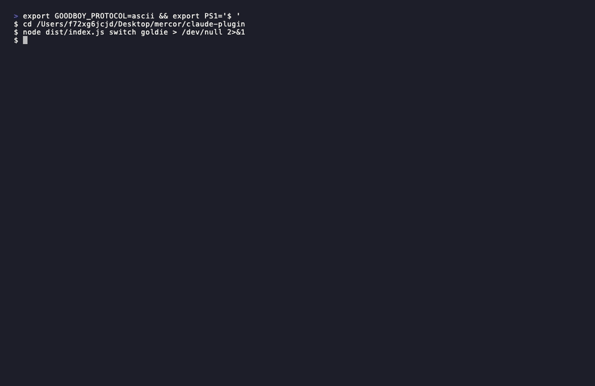
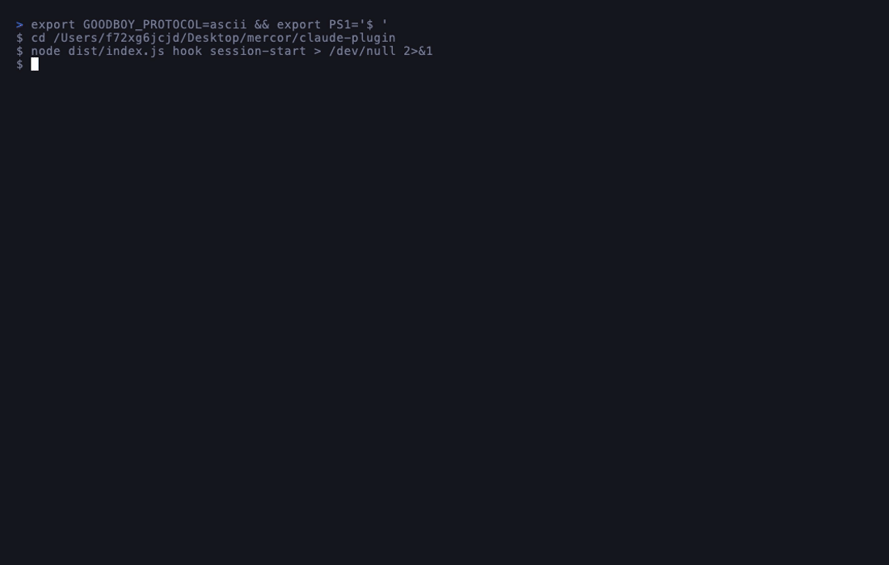

# goodboy 🐾

> A Tamagotchi for your terminal. Pick a dog. Ship code together.

**goodboy** is a Claude Code plugin that gives you a pixel-art dog companion living in your terminal. It reacts to your sessions, gates your deploys, gets hungry if you ignore it, and judges your legacy files with zero remorse.

---



---

> **6 personas. All different. All opinionated.**
>
> 

---

## Meet the pack

Pick your companion on first run. Switch anytime with `goodboy switch`.

| | Name | Breed | Personality |
|---|---|---|---|
| 🟡 | **Goldie** | Golden Retriever | Enthusiastic optimist. Celebrates everything, even the bad. |
| ⚫ | **Byte** | Border Collie | Focused and clever. Slightly smug. Keeps you on track. |
| 🟠 | **Shiba** | Shiba Inu | Sassy and independent. Roasts your code. Means well. |
| 🟤 | **Pugsy** | Pug | Lazy genius. Ships when you least expect it. |
| ⬜ | **Nova** | Husky | Energetic overachiever. Obsessed with fast, clean code. |
| 🟫 | **Debug** | Dachshund | Bug hunter. Keeps count. Never forgets. |

---

## Install

```bash
npm install -g goodboy-claude
goodboy init
```

That's it. `goodboy init` auto-patches your `~/.claude/settings.json` to wire up the three hooks. Pick a persona on first run:

```bash
goodboy init goldie   # golden retriever — default
goodboy init shiba    # shiba inu
goodboy init byte     # border collie
goodboy init pugsy    # pug
goodboy init nova     # husky
goodboy init debug    # dachshund
```

Switch anytime: `goodboy switch <name>`

---

## Commands

**Care**

| Command | Effect |
|---|---|
| `goodboy feed` | hunger +30. Dog does happy spin. |
| `goodboy treat` | hunger +15. Small bonus treat. |
| `goodboy bath` | hygiene +40. Dog is reluctant but cleaner. |
| `goodboy nap` | energy +35. Dog genuinely sleeps. |
| `goodboy walk` | energy +15, hunger -10. Enforced break. |
| `goodboy brew` | energy +20. Coffee solidarity. |

**Fun**

| Command | What happens |
|---|---|
| `goodboy rollover` | Classic trick. Always delightful. |
| `goodboy trick` | Random trick. Requires energy > 20. |
| `goodboy speak` | Random piece of per-persona wisdom. |
| `goodboy fetch` | Runs `git fetch`, narrates what came back. |
| `goodboy beg` | Dog makes a pointed request (tests, review, break). |

**Status & Info**

| Command | What it shows |
|---|---|
| `goodboy status` | Stat bars + mood + streak + experience level. |
| `goodboy mood` | Current mood, what's causing it, how to fix it. |
| `goodboy age` | Dog age, lifetime sessions, errors witnessed, deploys. |
| `goodboy level` | Experience level with full progression ladder. |
| `goodboy history` | Last 10 sessions from `~/.goodboy-log`. |
| `goodboy diary` | This session's events as they happened. |
| `goodboy report` | 7-day summary. `--month` for 30 days. |

**Codebase Health**

| Command | What it runs |
|---|---|
| `goodboy sniff` | TypeScript + ESLint + tests. Pass/fail with timing. |
| `goodboy vet` | Full scan: test coverage, TODOs, console.logs, large files, TS errors. Health score out of 100. |

**Configuration**

| Command | What it does |
|---|---|
| `goodboy switch` | List all personas with colors. |
| `goodboy switch <name>` | Change persona. Old dog says goodbye. New dog says hello. |
| `goodboy ignore <signal>` | Suppress a signal reaction permanently. |
| `goodboy ignore <signal> --remove` | Restore a suppressed signal. |
| `goodboy init` | Auto-install Claude Code hooks into `~/.claude/settings.json`. |

---

## How it works

goodboy hooks into Claude Code's session lifecycle — not every tool call, just the moments that matter:

| Moment | What the dog does |
|---|---|
| **Session start** | Wakes up, checks in based on mood and time of day |
| **Error streak (3+)** | Reacts — concerned, not annoying |
| **Pre-deploy** | Sit. Stay. Deploy. gate (see below) |
| **Session end** | Summarizes your day with a quip |

---

## The deploy gate

Run `goodboy sit` before deploying. It checks your `~/.goodboy.guard.json` config:

```json
{
  "blocked_days": [5],
  "blocked_hours": [0, 1, 2, 3, 22, 23],
  "custom_message": "check the oncall calendar before Friday pushes"
}
```

```
$ goodboy sit

  ⚠️  today is Friday — are you sure about this deploy?
  ⚠️  check the oncall calendar before Friday pushes

  Shiba  "sit. hold. today is Friday — are you sure about this deploy?. you know the rules."
```

Enable/disable the gate anytime:

```bash
goodboy sit --enable
goodboy sit --disable
```

Each persona narrates the gate in character. Goldie is supportive even when she blocks you. Shiba is not.

---

## Your dog has state

Everything lives in `~/.goodboy`. Your dog persists between sessions, remembers your streak, and celebrates its own birthday.

```json
{
  "persona": "shiba",
  "hunger": 72,
  "hygiene": 45,
  "energy": 88,
  "streak": 14,
  "born_at": "2025-05-03T00:00:00Z",
  "session_count": 42,
  "token_count": 1240000
}
```

Stats decay over time. Feed your dog. It remembers if you don't.

---

## Milestones

goodboy tracks things and celebrates quietly:

- 🎂 **Birthday** — dog goes full chaos mode once a year
- 📅 **Monthly anniversary** — brief moment of reflection
- 🔥 **Streaks** — 7 days, 30 days, 100 days
- 💬 **Token milestones** — 1M, 5M, 10M tokens together

---

## Contributing

The easiest PR you'll ever open: **add a quip.**

Each persona has 120 quips across 12 signal buckets. If you can write a funny one-liner in Debug's voice, open a PR. That's it. See [CONTRIBUTING.md](CONTRIBUTING.md).

---

## License

MIT — do whatever you want, just don't make goodboy sad.
